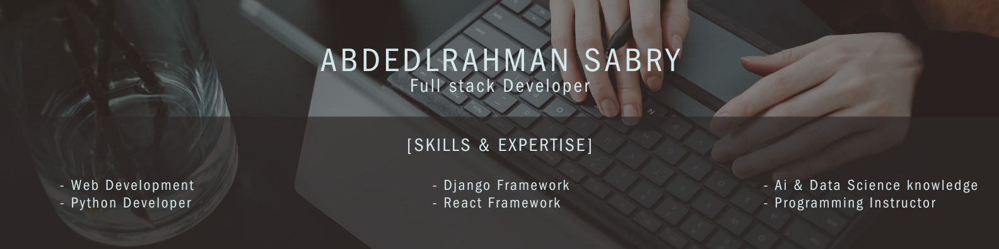

# 
# Hi there! 👋

Welcome to my GitHub profile! I'm **Abdelrahman Sabry (Abdo)**, a passionate **Full-Stack Developer** who loves crafting seamless web experiences and solving challenging problems. Here's a little about me and my skills:

---

## 🌟 About Me

- 🖥️ Full-Stack Developer with a focus on backend development.
- 📍 Based in Beheira Governorate, Egypt.
- 🎓 Graduated with a project distinction, focusing on building scalable and user-friendly web applications.
- 🎯 Enrolled in the ITI Full-Stack Development Course (Python Track).
- 🤖 Exploring AI to enhance web development projects.
- ☕ Coffee enthusiast and lifelong learner.
- 🧮 Solved over **500 problems** on Codeforces and **1500 problems** on HackerRank, enhancing my problem-solving and algorithmic skills.

---

## 💻 Technologies & Tools

### **Frontend**
-   
- **Frameworks**: 
- **Styling**: , CSS animations

### **Backend**
- **Frameworks**: 
- **Languages**: 
- **Database**: 

### **Other Tools**
-  
-  
- Canva & Figma (for design inspiration)

---

## 🚀 Projects

### 🌐 [Coffee Shop Website](https://github.com/A-132001/CoffeeShopProject)
A dynamic coffee shop website with features like:
- 🔑 User authentication (Sign-in/Sign-up)
- 🛍️ Product search and order checkout
- 📄 Pagination for a smooth browsing experience

### 🎓 Graduation Project: [College ERP System using Face Recognition](https://github.com/A-132001/CollegeERP_using_Face_Recognition)
A comprehensive system designed for academic institutions with:
- 🌐 **Website**: A complete platform for managing student and faculty data, courses, and schedules.
- 📸 **Face Recognition**: Attendance tracking using cameras installed in lecture halls.
- 🗄️ **Database Integration**: A seamless link between the website and a Python script managing the cameras.
- 🧠 Technology Highlights: Python, Django, PostgreSQL, and OpenCV for face recognition.

---

## 📫 How to Reach Me

- 💌 Email: [abdelrahmansabry53@gmail.com](abdelrahmansabry53@gmail.com)
- 💼 LinkedIn: [linkedin.com/in/abdelrahman-sabry](https://www.linkedin.com/in/abdelrahman-sabry-saber-4194b21a5/)

---

## 🌱 Fun Facts

- 🎮 I love playing PlayStation in my free time.
- 📝 I enjoy discussing ideas, especially about problem-solving and development challenges.
- 🌟 Always looking for exciting collaborations and learning opportunities!

Feel free to explore my repositories and connect with me! 🚀
